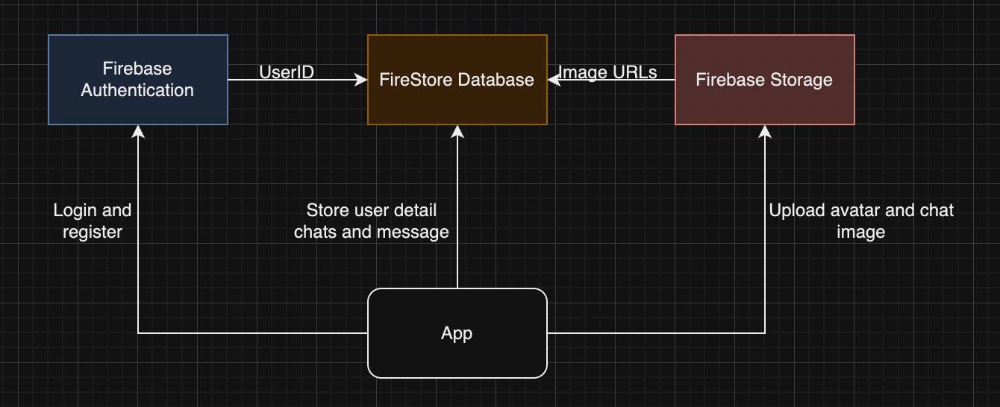

this is chatting website, learn from Lama dev using firebase as database
1. Flow
React app -Login and register-> Firebase Authentication
          -store user details chats and messages-> Firestore Database
          -upload avatar and chat image-> Firebase Storage
Firebase Authentication -get user ID-> Firestore Database <-image URLs- Firebase Storage

2. Class diagram 
